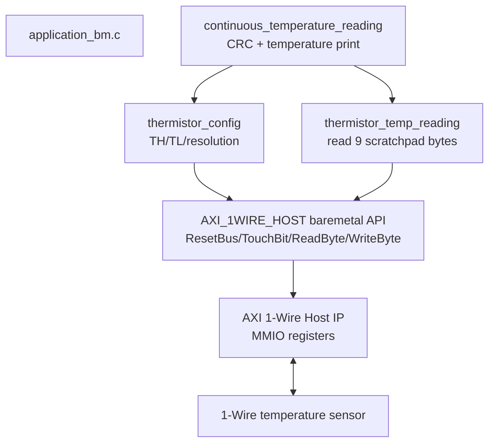
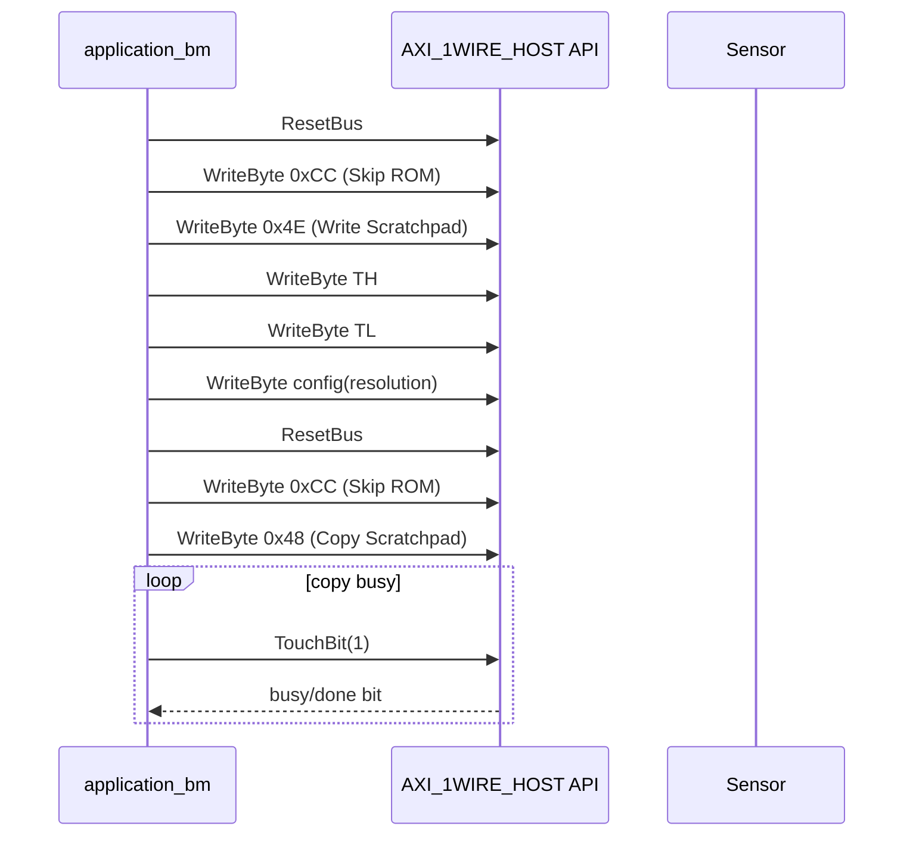
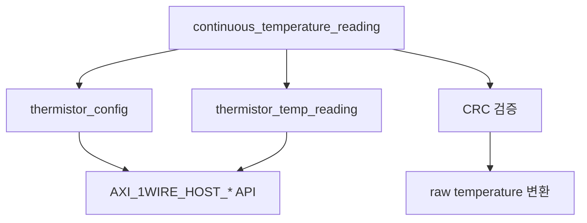

# `application_bm.c` 분석

## 개요

`application_bm.c`는 Vitis baremetal 환경에서 AXI 1-Wire Host baremetal driver를 사용해 1-Wire 온도 센서를 설정하고 연속으로 온도를 읽는 예제 애플리케이션입니다. `XPAR_AXI_1WIRE_HOST_0_BASEADDR`를 base address로 사용하며, 센서에는 DS18B20 계열 명령(`Skip ROM`, `Convert T`, `Read/Write Scratchpad`, `Copy Scratchpad`)을 전송합니다.

## 블록 다이어그램

## 주요 함수

| 함수 | 역할 |
|---|---|
| `thermistor_config` | 온도 상/하한과 해상도(9~12 bit)를 검증하고 scratchpad 설정을 EEPROM에 복사합니다. |
| `thermistor_temp_reading` | 온도 변환을 시작하고 scratchpad 9바이트를 읽어 호출자 포인터에 저장합니다. |
| `continuous_temperature_reading` | 설정을 수행한 뒤 무한 루프에서 온도 읽기, CRC 검증, 섭씨 온도 출력까지 수행합니다. |

## 센서 설정 흐름

## 온도 읽기 흐름

1. `ResetBus`로 presence를 확인합니다.
2. `0xCC` Skip ROM을 전송합니다.
3. `0x44` Convert Temperature를 전송합니다.
4. `TouchBit(1)`을 반복해 변환 완료를 기다립니다.
5. 다시 reset 후 `0xCC`, `0xBE` Read Scratchpad를 전송합니다.
6. 9바이트를 읽습니다. 앞 8바이트는 CRC 계산 대상이고 9번째 바이트는 CRC입니다.
7. CRC가 일치하면 raw temperature를 정수부/소수부로 변환해 출력합니다.

## 해상도 처리

| resolution | config 값 | 소수부 계산에 사용하는 bit |
|---:|---:|---|
| 9 | `0x1F` | `0.5°C` bit |
| 10 | `0x3F` | `0.5°C`, `0.25°C` bit |
| 11 | `0x5F` | `0.5°C`, `0.25°C`, `0.125°C` bit |
| 12 | `0x7F` | `0.5°C`, `0.25°C`, `0.125°C`, `0.0625°C` bit |

## 설계상 특징

- low-level register 접근은 직접 수행하지 않고 `axi_1wire_host.c`의 API를 사용합니다.
- 단일 1-Wire 센서를 가정하여 모든 ROM 선택 단계에서 `Skip ROM(0xCC)`을 사용합니다.
- 무한 루프 예제이므로 종료 조건이나 sleep/delay는 포함되어 있지 않습니다.

## 재검토 보강: Baremetal 예제 계층화

### 호출 그래프

### 센서 명령 요약

| 명령 | 값 | 사용 위치 | 의미 |
|---|---:|---|---|
| Skip ROM | `0xCC` | 설정/읽기 공통 | 단일 device 버스에서 ROM addressing 생략 |
| Write Scratchpad | `0x4E` | `thermistor_config` | TH/TL/config 기록 |
| Copy Scratchpad | `0x48` | `thermistor_config` | scratchpad 설정을 EEPROM에 저장 |
| Convert T | `0x44` | `thermistor_temp_reading` | 온도 변환 시작 |
| Read Scratchpad | `0xBE` | `thermistor_temp_reading` | 9바이트 scratchpad 읽기 |

### 분석 결론

이 예제는 센서 프로토콜을 애플리케이션 계층에 두고, AXI IP 접근은 baremetal driver API에 위임합니다. 따라서 다른 1-Wire slave를 붙일 때는 `AXI_1WIRE_HOST_*` primitive를 재사용하고 slave-specific command sequence만 교체하면 됩니다.
