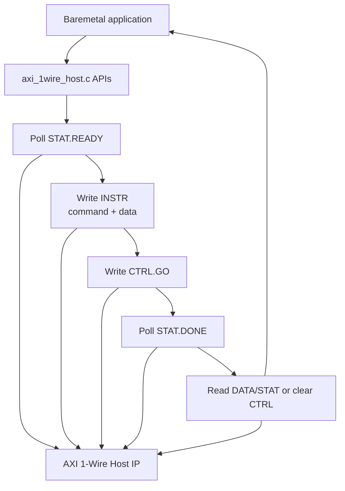
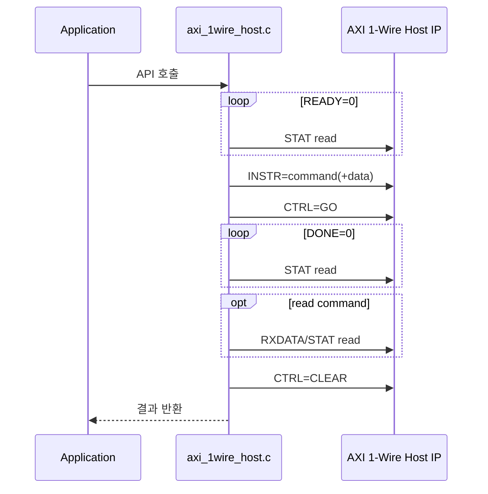

# `axi_1wire_host.c` 분석

## 개요

`axi_1wire_host.c`는 AXI 1-Wire Host IP를 baremetal 환경에서 제어하기 위한 high-level API 구현입니다. 각 함수는 IP의 `READY` 상태를 polling하고 instruction/control 레지스터를 조작한 뒤 `DONE` 상태를 polling하는 방식으로 reset, bit/byte read/write, GPIO 직접 제어 기능을 제공합니다.

## 블록 다이어그램

## 함수별 분석

| 함수 | 동작 |
|---|---|
| `AXI_1WIRE_HOST_Reset` | control 레지스터에 `0x80000000`을 써서 IP reset을 assert합니다. |
| `AXI_1WIRE_HOST_TouchBit` | `READY`를 기다린 뒤 `bit=1`이면 read-bit, 아니면 write-bit 명령을 실행합니다. read인 경우 `RXDATA[0]`을 반환합니다. |
| `AXI_1WIRE_HOST_ReadByte` | `READBYTE` 명령을 실행하고 `RXDATA[7:0]`을 반환합니다. |
| `AXI_1WIRE_HOST_WriteByte` | `WRITEBYTE + byte` 명령을 실행합니다. |
| `AXI_1WIRE_HOST_ResetBus` | IP reset 후 `INITPRES`를 실행하고 status MSB failure bit를 반환합니다. `0`은 device present, `1`은 미검출입니다. |
| `AXI_1WIRE_HOST_GPIO_Read` | instruction 레지스터에 GPIO read mode 값을 쓰고 GPIO data bit를 읽습니다. |
| `AXI_1WIRE_HOST_GPIO_Write` | instruction 레지스터에 GPIO write mode 값을 써서 bus level을 직접 제어합니다. |

## 공통 명령 흐름

## 레지스터 사용 패턴

| 단계 | 레지스터 | 값/조건 |
|---|---|---|
| ready 대기 | `STAT` | `0x00000010` bit가 set될 때까지 polling합니다. |
| 명령 기록 | `INSTR` | `READBIT`, `WRITEBIT+bit`, `READBYTE`, `WRITEBYTE+byte`, `INITPRES` 중 하나입니다. |
| 시작 | `CTRL` | `0x00000001` (`GO`)를 씁니다. |
| 완료 대기 | `STAT` | `0x00000001` (`DONE`) bit가 set될 때까지 polling합니다. |
| 결과 읽기 | `RXDATA`/`STAT` | read data 또는 presence failure bit를 읽습니다. |
| 종료 | `CTRL` | `0x00000000`으로 `GO`를 clear합니다. |

## 설계상 특징

- interrupt를 사용하지 않는 polling 기반 baremetal driver입니다.
- API가 1-Wire command sequence의 단일 primitive를 제공하고, 센서별 프로토콜은 애플리케이션 계층에서 조합합니다.
- GPIO read/write 함수는 1-Wire master FSM을 우회하여 버스 레벨을 직접 확인하거나 구동하는 용도로 제공됩니다.

## 재검토 보강: 함수별 레지스터 시퀀스

| 함수 | Instruction register | Control register | 결과 read |
|---|---|---|---|
| `ResetBus` | `INITPRES` | `RESET` 후 `GO` | `STAT[31]` failure bit |
| `TouchBit(bit=1)` | `READBIT` | `GO` | `RXDATA[0]` |
| `TouchBit(bit=0)` | `WRITEBIT + 0` | `GO` | 없음 |
| `ReadByte` | `READBYTE` | `GO` | `RXDATA[7:0]` |
| `WriteByte` | `WRITEBYTE + byte` | `GO` | 없음 |
| `GPIO_Read` | `0x80800000` | 사용 안 함 | `GPIODATA[0]` |
| `GPIO_Write` | `0x80010000` 또는 `0x80000000` | 사용 안 함 | 없음 |

### Polling 방식의 의미

이 구현은 interrupt controller 설정 없이도 동작하도록 모든 완료 조건을 MMIO polling으로 확인합니다. 따라서 초기 bring-up에는 단순하고 유용하지만, 긴 변환 대기나 OS 환경에서는 CPU 점유를 줄이기 위해 interrupt 기반 방식이 더 적합합니다.
