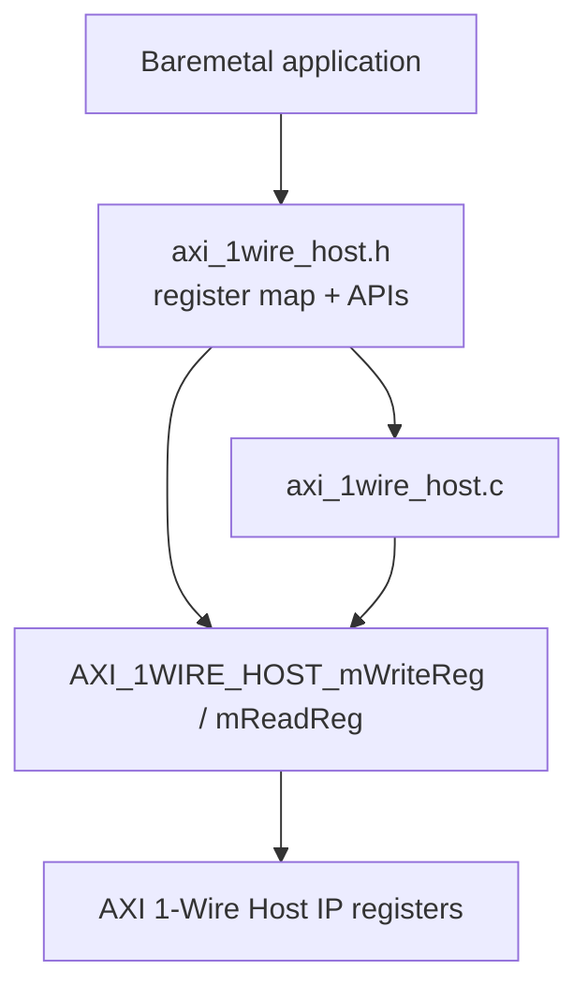
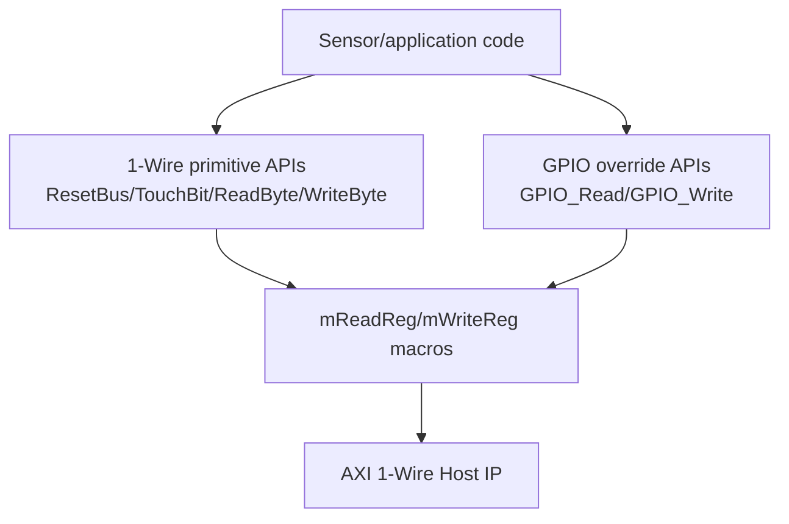

# `axi_1wire_host.h` 분석

## 개요

`axi_1wire_host.h`는 AXI 1-Wire Host baremetal driver의 public header입니다. MMIO 레지스터 offset, 1-Wire 명령 상수, `Xil_In32`/`Xil_Out32` 기반 register access macro, 그리고 high-level 1-Wire API prototype을 제공합니다.

## 블록 다이어그램

## 레지스터 offset

| 매크로 | Offset | 의미 |
|---|---:|---|
| `AXI_1WIRE_HOST_INSTR_REG_OFFSET` | `0x0` | 명령 및 송신 데이터 레지스터입니다. |
| `AXI_1WIRE_HOST_CTRL_REG_OFFSET` | `0x4` | `GO`, reset 제어 레지스터입니다. |
| `AXI_1WIRE_HOST_IRQCTRL_REG_OFFSET` | `0x8` | 인터럽트 제어 레지스터입니다. |
| `AXI_1WIRE_HOST_STAT_REG_OFFSET` | `0xC` | 상태 레지스터입니다. |
| `AXI_1WIRE_HOST_RXDATA_REG_OFFSET` | `0x10` | 수신 데이터 레지스터입니다. |
| `AXI_1WIRE_HOST_GPIODATA_REG_OFFSET` | `0x14` | GPIO 모드 bus level 확인용 레지스터입니다. |
| `AXI_1WIRE_HOST_IPVER_REG_OFFSET` | `0x18` | IP 버전 레지스터입니다. |
| `AXI_1WIRE_HOST_IPID_REG_OFFSET` | `0x1C` | IP ID 레지스터입니다. |

## 명령 상수

| 매크로 | 값 | 의미 |
|---|---:|---|
| `AXI_1WIRE_HOST_INITPRES` | `0x0800` | reset/presence detect 명령입니다. |
| `AXI_1WIRE_HOST_READBIT` | `0x0C00` | 1비트 읽기 명령입니다. |
| `AXI_1WIRE_HOST_WRITEBIT` | `0x0E00` | 1비트 쓰기 명령입니다. |
| `AXI_1WIRE_HOST_READBYTE` | `0x0D00` | 1바이트 읽기 명령입니다. |
| `AXI_1WIRE_HOST_WRITEBYTE` | `0x0F00` | 1바이트 쓰기 명령입니다. |
| `AXI_1WIRE_HOST_RESET` | `0x80000000` | 제어 reset bit입니다. |

## Register access macro

| 매크로 | 역할 |
|---|---|
| `AXI_1WIRE_HOST_mWriteReg(BaseAddress, RegOffset, Data)` | `Xil_Out32(BaseAddress + RegOffset, Data)`로 32비트 MMIO write를 수행합니다. |
| `AXI_1WIRE_HOST_mReadReg(BaseAddress, RegOffset)` | `Xil_In32(BaseAddress + RegOffset)`로 32비트 MMIO read를 수행합니다. |

## Public API

| 함수 | 역할 |
|---|---|
| `AXI_1WIRE_HOST_Reset` | IP를 reset 상태로 둡니다. |
| `AXI_1WIRE_HOST_TouchBit` | write/read slot을 수행합니다. `bit=1`이면 bus level read 용도로 사용됩니다. |
| `AXI_1WIRE_HOST_ReadByte` | 1바이트를 수신합니다. |
| `AXI_1WIRE_HOST_WriteByte` | 1바이트를 송신합니다. |
| `AXI_1WIRE_HOST_ResetBus` | reset/presence sequence를 수행하고 device presence 결과를 반환합니다. |
| `AXI_1WIRE_HOST_SelfTest` | IP ID/version을 읽어 기본 연결을 확인합니다. |
| `AXI_1WIRE_HOST_GPIO_Read` | GPIO 직접 제어 모드로 bus level을 읽습니다. |
| `AXI_1WIRE_HOST_GPIO_Write` | GPIO 직접 제어 모드로 bus level을 설정합니다. |

## 재검토 보강: API 계층별 사용 의도

| API 계층 | 사용 의도 |
|---|---|
| Register macro | IP register를 직접 검증하거나 custom sequence를 작성할 때 사용합니다. |
| 1-Wire primitive | 대부분의 1-Wire slave protocol 구현에 사용하는 기본 read/write/reset 동작입니다. |
| GPIO override | master FSM이 아닌 직접 bus level 제어/관찰이 필요할 때 사용합니다. |
| Self-test | hardware handoff 후 base address와 IP identity를 빠르게 확인할 때 사용합니다. |
