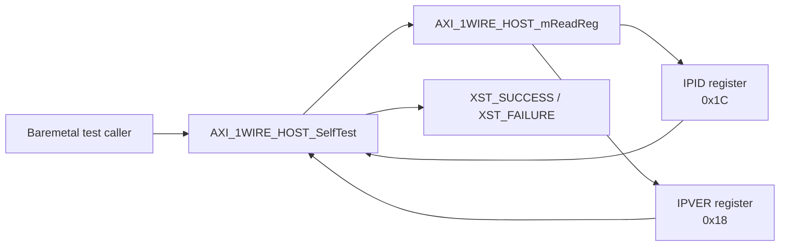
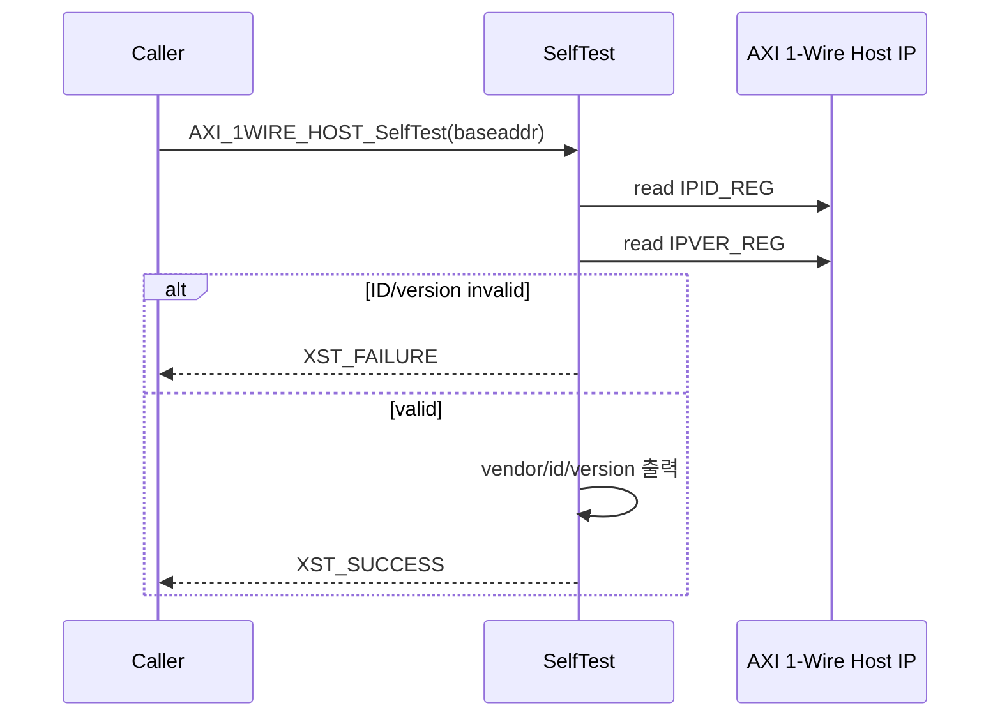

# `axi_1wire_host_selftest.c` 분석

## 개요

`axi_1wire_host_selftest.c`는 AXI 1-Wire Host baremetal driver의 간단한 self-test 구현입니다. IP ID와 IP version 레지스터를 읽어 하드웨어가 예상한 AXI 1-Wire Host인지 확인하고, 결과를 `XST_SUCCESS` 또는 `XST_FAILURE`로 반환합니다.

## 블록 다이어그램

## 검사 항목

| 항목 | 기대값/조건 | 실패 시 동작 |
|---|---|---|
| IP ID | `0x10EE4453` | ID 불일치 메시지 출력 후 `XST_FAILURE` 반환 |
| IP version format | `(ip_ver >> 24) & 0xFF == 0x76` | version format 오류 메시지 출력 후 `XST_FAILURE` 반환 |

## 실행 흐름

## 설계상 특징

- 실제 1-Wire bus transaction은 수행하지 않고, register access와 IP identity만 확인합니다.
- 하드웨어 주소 매핑이 잘못되었거나 다른 IP가 연결된 경우 빠르게 실패하도록 구성되어 있습니다.
- 주석상 destructive test 가능성을 언급하지만 현재 구현은 ID/version read만 수행합니다.
