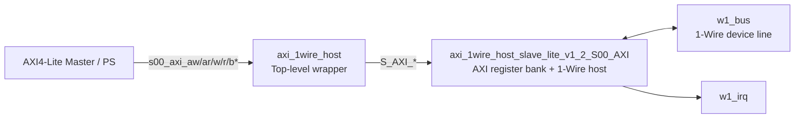

# `axi_1wire_host.v` 분석

## 개요

`axi_1wire_host`는 AXI 1-Wire Host IP의 최상위 래퍼 모듈입니다. 외부에는 AXI4-Lite 슬레이브 인터페이스, 1-Wire 양방향 버스(`w1_bus`), 인터럽트 출력(`w1_irq`)을 노출하고, 내부적으로 실제 기능을 담당하는 `axi_1wire_host_slave_lite_v1_2_S00_AXI` 모듈을 1개 인스턴스화합니다.

## 파라미터

| 파라미터 | 기본값 | 설명 |
|---|---:|---|
| `CLK_DIV_VAL_TO_1MHz` | `100` | AXI 클록을 1 MHz 1-Wire 타이밍 기준 클록으로 분주하기 위한 값입니다. |
| `C_S00_AXI_DATA_WIDTH` | `32` | AXI4-Lite 데이터 폭입니다. |
| `C_S00_AXI_ADDR_WIDTH` | `5` | AXI4-Lite 주소 폭입니다. |

## 포트

| 포트 | 방향 | 설명 |
|---|---|---|
| `w1_bus` | `inout` | 외부 1-Wire 디바이스와 연결되는 단일 양방향 데이터 라인입니다. |
| `w1_irq` | `output` | 1-Wire 컨트롤러 상태에 따라 PS로 전달되는 인터럽트입니다. |
| `s00_axi_*` | AXI4-Lite | Vivado IP Packager 스타일의 AXI4-Lite 슬레이브 인터페이스입니다. |

## 블록 다이어그램

## 내부 구조

이 파일은 별도의 사용자 로직을 직접 구현하지 않습니다. 모든 AXI 신호와 사용자 포트는 `axi_1wire_host_slave_lite_v1_2_S00_AXI_inst` 인스턴스로 그대로 연결됩니다.

### 주요 연결

| 최상위 신호 | 하위 모듈 신호 | 설명 |
|---|---|---|
| `s00_axi_aclk` | `S_AXI_ACLK` | AXI 및 레지스터 로직 클록입니다. |
| `s00_axi_aresetn` | `S_AXI_ARESETN` | Active-low AXI 리셋입니다. |
| `s00_axi_*` | `S_AXI_*` | AXI4-Lite 채널 신호입니다. |
| `w1_bus` | `w1_bus` | 1-Wire 버스를 하위 모듈의 IOBUF 로직으로 전달합니다. |
| `w1_irq` | `w1_irq` | 하위 모듈이 생성한 인터럽트를 외부로 전달합니다. |

## 동작 요약

1. AXI 마스터가 `s00_axi_*` 인터페이스를 통해 레지스터를 읽고 씁니다.
2. 최상위 래퍼는 AXI 트랜잭션을 변경하지 않고 하위 AXI-Lite/1-Wire 모듈로 전달합니다.
3. 하위 모듈이 1-Wire 버스 제어, 상태 레지스터 갱신, 인터럽트 생성을 수행합니다.

## 설계상 특징

- Vivado IP Packager가 생성하는 표준 최상위 래퍼 형태입니다.
- 실제 1-Wire 프로토콜, 레지스터 맵, 인터럽트 로직은 하위 모듈에 집중되어 있습니다.
- 상위 통합 관점에서는 AXI4-Lite 인터페이스와 1-Wire 물리 라인을 결합하는 얇은 연결 계층입니다.
