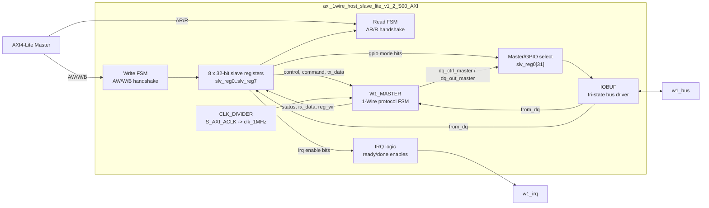

# `axi_1wire_host_slave_lite_v1_2_S00_AXI.v` 분석

## 개요

`axi_1wire_host_slave_lite_v1_2_S00_AXI`는 AXI4-Lite 슬레이브 레지스터 뱅크와 1-Wire 마스터 코어를 결합하는 핵심 통합 모듈입니다. AXI에서 접근 가능한 8개의 32비트 레지스터를 제공하고, 레지스터 비트를 `W1_MASTER`, `CLK_DIVIDER`, `IOBUF`에 연결해 1-Wire 버스 동작을 제어합니다.

## 블록 다이어그램



## 파라미터

| 파라미터 | 기본값 | 설명 |
|---|---:|---|
| `CLK_DIV_VAL_TO_1MHz` | `100` | `S_AXI_ACLK`를 1 MHz로 분주하기 위한 값입니다. |
| `C_S_AXI_DATA_WIDTH` | `32` | AXI4-Lite 데이터 폭입니다. |
| `C_S_AXI_ADDR_WIDTH` | `5` | AXI4-Lite 주소 폭입니다. |

## 주요 포트

| 포트 | 방향 | 설명 |
|---|---|---|
| `w1_bus` | `inout` | 1-Wire 외부 버스입니다. 내부 `IOBUF`를 통해 구동/해제됩니다. |
| `w1_irq` | `output reg` | `done` 또는 `ready` 상태와 인터럽트 enable 비트 조합으로 생성됩니다. |
| `S_AXI_*` | AXI4-Lite | 레지스터 접근용 AXI4-Lite 슬레이브 인터페이스입니다. |

## 레지스터 맵 분석

주소 선택은 `axi_*addr[ADDR_LSB+OPT_MEM_ADDR_BITS:ADDR_LSB]`의 3비트 값으로 이루어지며, 8개의 32비트 레지스터가 있습니다.

| 레지스터 | 주요 비트 | 방향 | 의미 |
|---|---|---|---|
| `slv_reg0` | `[31]` | SW→HW | `master_gpio_sel`: `0`이면 `W1_MASTER`, `1`이면 GPIO 직접 제어 경로를 선택합니다. |
| `slv_reg0` | `[23]` | SW→HW | `dq_ctrl_gpio`: GPIO 모드에서 IOBUF tri-state 제어입니다. |
| `slv_reg0` | `[16]` | SW→HW | `dq_out_gpio`: GPIO 모드에서 1-Wire 출력 데이터입니다. |
| `slv_reg0` | `[11:8]` | SW→HW | `command`: `W1_MASTER`에 전달되는 4비트 명령입니다. |
| `slv_reg0` | `[7:0]` | SW→HW | `tx_data`: 송신할 1비트/1바이트 데이터입니다. |
| `slv_reg1` | `[31]` | SW→HW | `ctrl_reset`: 1-Wire 마스터 제어 리셋입니다. |
| `slv_reg1` | `[0]` | SW→HW | `go`: 명령 실행 시작 핸드셰이크 비트입니다. |
| `slv_reg2` | `[4]` | SW→HW | `ready` 인터럽트 enable입니다. |
| `slv_reg2` | `[0]` | SW→HW | `done` 인터럽트 enable입니다. |
| `slv_reg3` | `[31]` | HW→SW | `failure`: presence pulse 미검출 등 실패 상태입니다. |
| `slv_reg3` | `[4]` | HW→SW | `ready`: 다음 명령을 받을 수 있는 상태입니다. |
| `slv_reg3` | `[0]` | HW→SW | `done`: 명령 실행 완료 상태입니다. |
| `slv_reg4` | `[7:0]` | HW→SW | `rx_data`: 1-Wire에서 수신한 데이터입니다. |
| `slv_reg5` | `[0]` | HW→SW | `from_dq`: 현재 1-Wire 입력 샘플입니다. |
| `slv_reg6` | `[31:0]` | 상수/ID | 리셋 시 `32'h76000102`로 초기화됩니다. 주석상 버전 `v01.2`입니다. |
| `slv_reg7` | `[31:0]` | 상수/ID | 리셋 시 `32'h10ee4453`으로 초기화됩니다. 주석상 Xilinx vendor/subsystem ID 및 `DS` 식별자입니다. |

## AXI4-Lite 처리

### 쓰기 경로

- `state_write`는 `Idle`, `Waddr`, `Wdata` 상태로 구성됩니다.
- AW 주소와 W 데이터를 수락하고 `axi_bvalid`로 write response를 생성합니다.
- `S_AXI_WSTRB`를 사용해 byte enable 단위로 `slv_reg0`~`slv_reg7`을 갱신합니다.
- 하드웨어 상태 갱신(`reg_wr`)이 발생하면 `slv_reg3`, `slv_reg4`, `slv_reg5`가 1-Wire 마스터의 상태/수신값으로 갱신됩니다.

### 읽기 경로

- `state_read`는 `Idle`, `Raddr`, `Rdata` 상태로 구성됩니다.
- AR 주소를 래치한 뒤 선택된 레지스터 값을 `S_AXI_RDATA`로 반환합니다.

## 1-Wire 연동 로직

### 클록 분주

`CLK_DIVIDER` 인스턴스가 `S_AXI_ACLK`를 `clk_1MHz`로 변환합니다. 이 1 MHz 클록은 1-Wire 프로토콜의 µs 단위 타이밍 기준으로 사용됩니다.

### 마스터 코어

`W1_MASTER`는 다음 신호로 제어됩니다.

| 신호 | 출처/목적 |
|---|---|
| `ctrl_reset` | `slv_reg1[31]`에서 생성됩니다. |
| `go` | `slv_reg1[0]`에서 생성됩니다. |
| `command` | `slv_reg0[11:8]`에서 생성됩니다. |
| `tx_data` | `slv_reg0[7:0]`에서 생성됩니다. |
| `done`, `ready`, `failure`, `rx_data` | `W1_MASTER`가 생성하며 `reg_wr` 시 레지스터에 반영됩니다. |

### GPIO 우회 모드

`slv_reg0[31]`이 `1`이면 1-Wire 마스터 대신 GPIO 비트(`dq_ctrl_gpio`, `dq_out_gpio`)가 IOBUF를 직접 제어합니다. `0`이면 `W1_MASTER`의 `dq_ctrl_master`, `dq_out_master`가 사용됩니다.

## 인터럽트 생성

`w1_irq`는 다음 조건 중 하나가 참이면 assert됩니다.

```verilog
(slv_reg2[0] && slv_reg3[0]) || (slv_reg2[4] && slv_reg3[4])
```

즉, `done` 인터럽트가 enable된 상태에서 `done`이 set되거나, `ready` 인터럽트가 enable된 상태에서 `ready`가 set되면 인터럽트가 발생합니다.

## 동작 흐름

1. 소프트웨어가 `slv_reg0`에 명령과 송신 데이터를 기록합니다.
2. 소프트웨어가 `slv_reg1[0]`의 `go`를 set합니다.
3. `W1_MASTER`가 1 MHz 클록 기준으로 1-Wire 명령을 수행합니다.
4. 완료 시 `done`, `ready`, `failure`, `rx_data`가 `reg_wr`와 함께 레지스터 뱅크에 반영됩니다.
5. enable 비트가 설정되어 있으면 `w1_irq`가 발생합니다.
6. 소프트웨어가 상태/데이터를 읽고 `go`를 clear해 다음 명령을 준비합니다.

## 설계상 특징

- AXI 레지스터 레이어와 1-Wire 프로토콜 FSM이 분리되어 있습니다.
- 1-Wire 마스터 자동 제어와 GPIO 직접 제어를 동일 IOBUF 앞에서 선택할 수 있습니다.
- 상태 레지스터 업데이트는 `reg_wr` 신호로 제어되어 소프트웨어가 polling 또는 interrupt 방식으로 사용할 수 있습니다.
