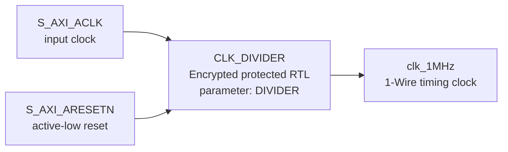

# `clk_div.v` 분석

## 개요

`clk_div.v`는 AMD/Xilinx encrypted Verilog(`pragma protect`)로 제공되는 클록 분주 모듈입니다. 평문 RTL 본문은 암호화되어 있어 내부 구현을 직접 확인할 수 없지만, 상위 모듈에서 `CLK_DIVIDER`라는 모듈명으로 인스턴스화되며 AXI 클록을 1 MHz 1-Wire 기준 클록으로 변환하는 역할을 합니다.

## 블록 다이어그램

## 확인 가능한 인터페이스

`axi_1wire_host_slave_lite_v1_2_S00_AXI.v`의 인스턴스 연결을 기준으로 확인 가능한 인터페이스는 다음과 같습니다.

| 항목 | 값/신호 | 설명 |
|---|---|---|
| 모듈명 | `CLK_DIVIDER` | 암호화된 클록 분주 모듈입니다. |
| 파라미터 | `DIVIDER` | 상위의 `CLK_DIV_VAL_TO_1MHz`가 전달됩니다. |
| 입력 | `areset` | `S_AXI_ARESETN`에 연결됩니다. 이름은 `areset`이지만 상위에서는 active-low 리셋을 전달합니다. |
| 입력 | `clk_in` | `S_AXI_ACLK`에 연결됩니다. |
| 출력 | `clk_out` | `clk_1MHz`에 연결되어 `W1_MASTER`로 전달됩니다. |

## 역할

- `S_AXI_ACLK` 주파수를 1-Wire 프로토콜 FSM이 요구하는 1 MHz 기준 클록으로 낮춥니다.
- `DIVIDER` 값은 IP 파라미터 `CLK_DIV_VAL_TO_1MHz`로 제어됩니다.
- 출력 `clk_1MHz`는 `W1_MASTER` 내부에서 1 µs, 20 µs, 80 µs, 480 µs 타이밍 생성의 기준이 됩니다.

## 제한 사항

- 이 파일의 기능 RTL은 `pragma protect`로 암호화되어 있으므로 counter 구조, duty cycle 보정 방식, reset 처리의 세부 구현은 이 저장소의 평문 코드만으로는 검증할 수 없습니다.
- 분석은 암호화 헤더와 상위 모듈의 인스턴스 연결을 기반으로 합니다.
