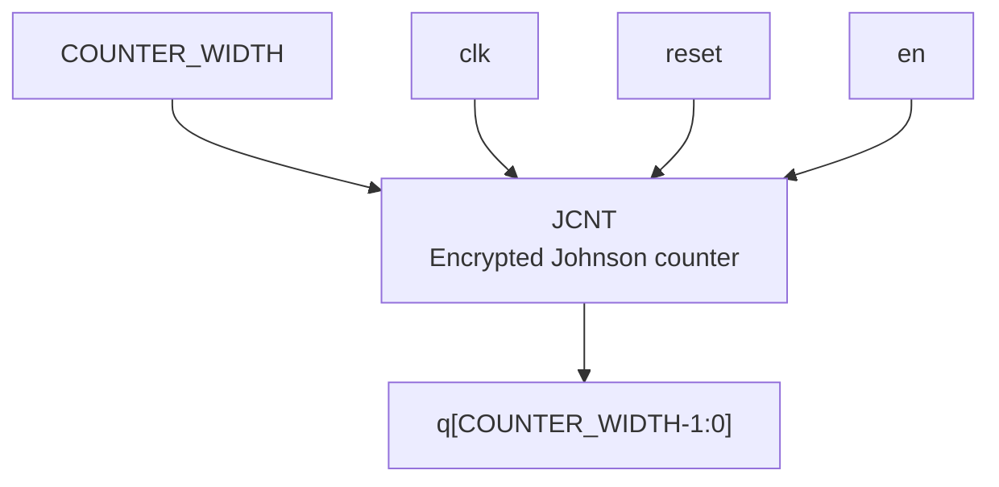
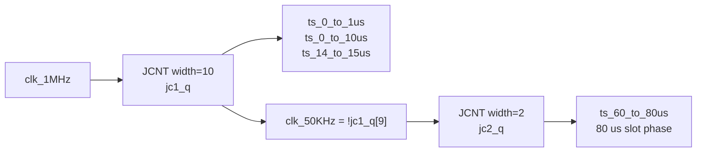

# `jcnt.v` 분석

## 개요

`jcnt.v`는 AMD/Xilinx encrypted Verilog(`pragma protect`)로 제공되는 Johnson counter 모듈입니다. 평문 RTL 본문은 암호화되어 있지만, `w1_master.v`에서 `JCNT` 모듈로 두 번 인스턴스화되며 1-Wire timing slot 생성을 담당합니다.

## 블록 다이어그램

## 확인 가능한 인터페이스

`w1_master.v`의 인스턴스 연결을 기준으로 확인 가능한 인터페이스는 다음과 같습니다.

| 항목 | 설명 |
|---|---|
| 모듈명 | `JCNT` |
| 파라미터 | `COUNTER_WIDTH` |
| 입력 | `clk` |
| 입력 | `reset` |
| 입력 | `en` |
| 출력 | `q` |

## 사용 위치

| 인스턴스 | 파라미터 | 클록 | 출력 | 역할 |
|---|---:|---|---|---|
| `jc_1us_20us` | `10` | `clk_1MHz` | `jc1_q[9:0]` | 1 µs 기준을 20 µs 구간으로 나누고 `clk_50KHz` 생성에 사용됩니다. |
| `jc_20us_80us` | `2` | `clk_50KHz` | `jc2_q[1:0]` | 20 µs slot을 4단계로 나누어 80 µs 1-Wire slot 구간을 구분합니다. |

## 타이밍 생성에서의 역할

## 제한 사항

- 내부 Johnson counter 구현은 암호화되어 있어 reset 시퀀스, bit transition, 정확한 초기값은 평문으로 확인할 수 없습니다.
- 다만 `w1_master.v`의 주석과 조합 로직을 통해 `q`가 1-Wire slot 구분을 위한 phase 신호로 사용됨을 확인할 수 있습니다.
