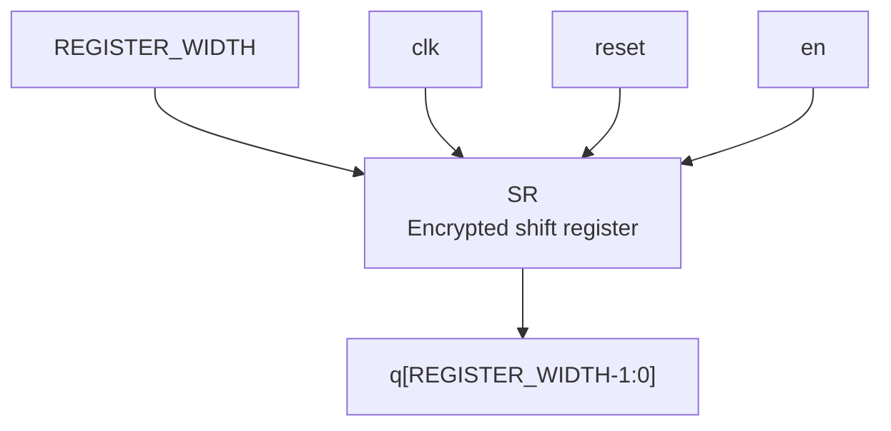
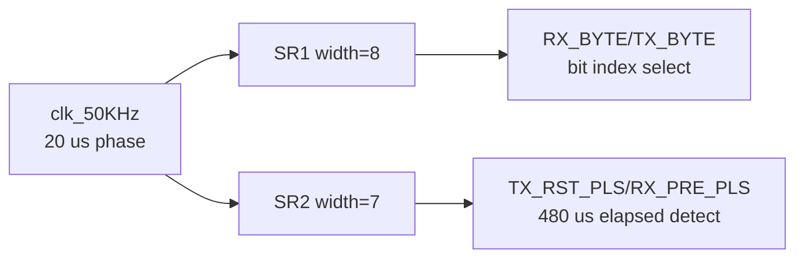

# `sr.v` 분석

## 개요

`sr.v`는 AMD/Xilinx encrypted Verilog(`pragma protect`)로 제공되는 shift register 모듈입니다. 평문 RTL 본문은 암호화되어 있지만, `w1_master.v`에서 `SR` 모듈로 두 번 인스턴스화되어 bit 위치 카운트와 긴 시간 구간 카운트에 사용됩니다.

## 블록 다이어그램

## 확인 가능한 인터페이스

`w1_master.v`의 인스턴스 연결을 기준으로 확인 가능한 인터페이스는 다음과 같습니다.

| 항목 | 설명 |
|---|---|
| 모듈명 | `SR` |
| 파라미터 | `REGISTER_WIDTH` |
| 입력 | `clk` |
| 입력 | `reset` |
| 입력 | `en` |
| 출력 | `q` |

## 사용 위치

| 인스턴스 | 파라미터 | 클록 | 출력 | 역할 |
|---|---:|---|---|---|
| `SR1` | `8` | `clk_50KHz` | `sr1_q[7:0]` | byte 송수신 시 현재 bit 위치를 나타냅니다. |
| `SR2` | `7` | `clk_50KHz` | `sr2_q[6:0]` | reset pulse 및 presence detect의 약 480 µs 대기 구간을 만드는 데 사용됩니다. |

## 1-Wire FSM에서의 역할

## 동작 추정

- `SR1`은 `sr1_en`이 활성화될 때 bit marker를 다음 위치로 이동시키며, `sr1_q[7]`이 set되면 8번째 bit 처리 완료로 사용됩니다.
- `SR2`는 `ts_60_to_80us` 구간마다 enable되어 긴 시간 구간을 누적합니다. `sr2_q[6]` 또는 `sr2_q[5]`가 reset/presence 단계 완료 조건으로 사용됩니다.

## 제한 사항

- 내부 shift 방식, reset 시 초기 one-hot 위치, enable 처리의 정확한 구현은 암호화되어 있어 평문 코드만으로는 확인할 수 없습니다.
- 분석은 `w1_master.v`의 인스턴스 연결과 출력 bit 사용 위치를 기반으로 합니다.
