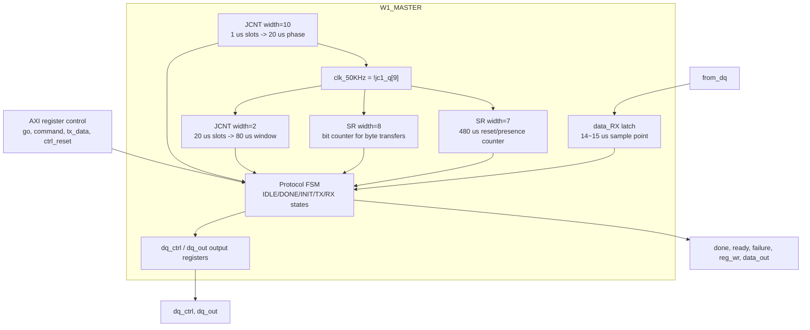
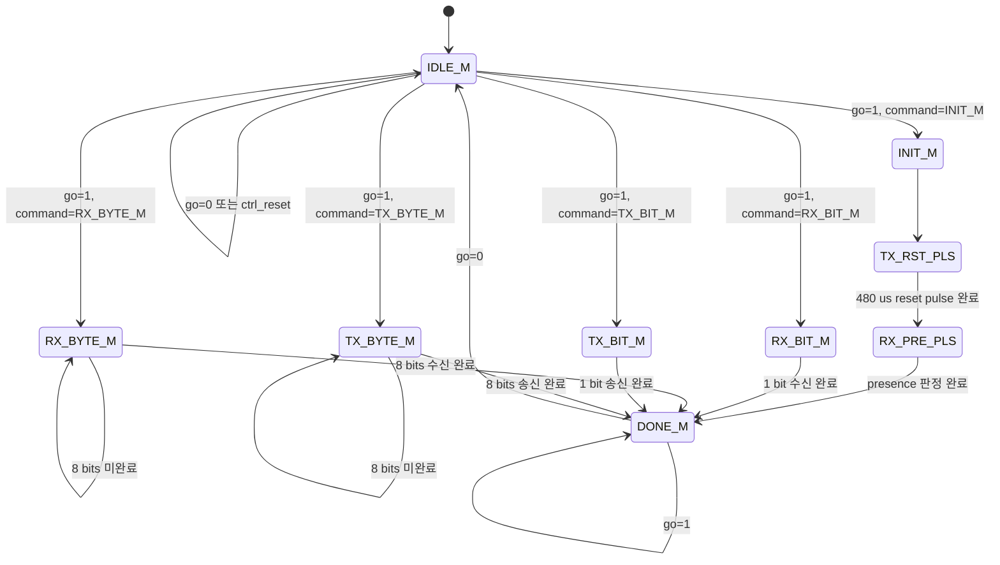
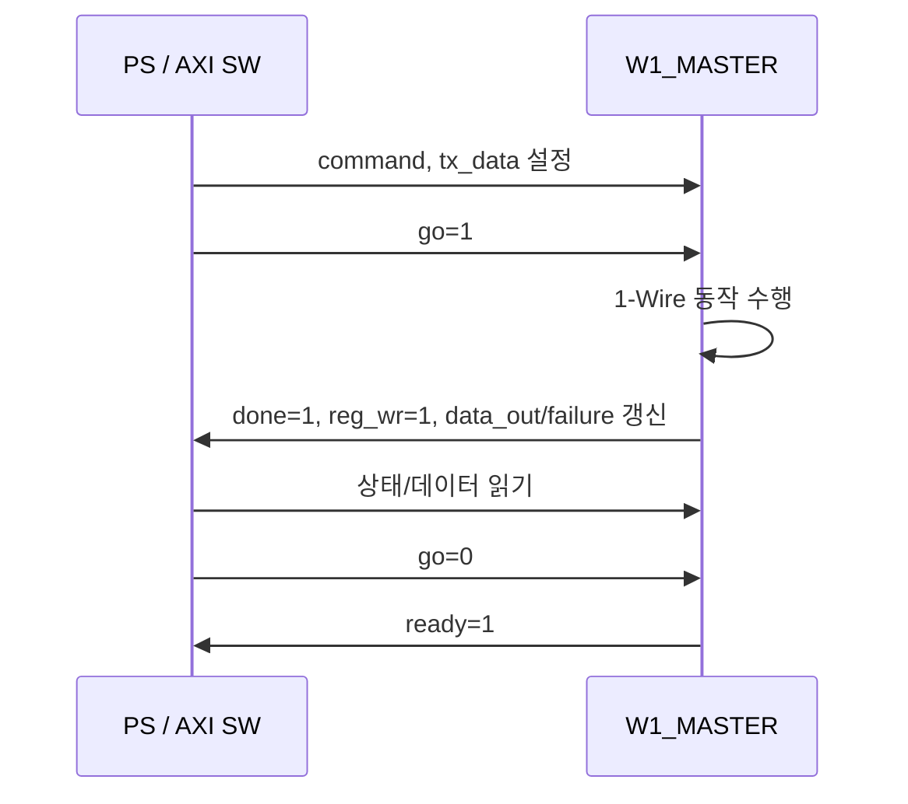

# `w1_master.v` 분석

## 개요

`W1_MASTER`는 1-Wire 버스의 reset/presence detect, bit/byte 송신, bit/byte 수신을 수행하는 프로토콜 FSM입니다. 상위 AXI 레지스터 블록에서 `go`, `command`, `tx_data`를 받고, 실행 결과를 `done`, `ready`, `failure`, `data_out`, `reg_wr`로 반환합니다.

## 블록 다이어그램

## 포트

| 포트 | 방향 | 설명 |
|---|---|---|
| `clk_1MHz` | input | 1-Wire 타이밍 기준 클록입니다. 1주기는 1 µs입니다. |
| `areset` | input | 상위 active-low 리셋입니다. 내부에서는 `!areset \\| ctrl_reset`으로 active-high `reset`을 생성합니다. |
| `ctrl_reset` | input | 소프트웨어가 AXI 레지스터로 발생시키는 제어 리셋입니다. |
| `go` | input | 명령 실행 시작 신호입니다. |
| `command[3:0]` | input | 실행할 1-Wire 명령입니다. |
| `tx_data[7:0]` | input | 송신할 데이터입니다. bit 명령에서는 LSB가 사용됩니다. |
| `from_dq` | input | 1-Wire 버스 입력 샘플입니다. |
| `dq_ctrl` | output reg | IOBUF tri-state 제어에 사용됩니다. 코드 주석 기준 `1`은 read/release, `0`은 write/drive입니다. |
| `dq_out` | output reg | 1-Wire 버스로 구동할 출력값입니다. |
| `done` | output reg | 현재 명령 완료 상태입니다. |
| `ready` | output reg | 다음 명령을 받을 수 있는 상태입니다. |
| `reg_wr` | output reg | 상위 AXI 레지스터에 상태/데이터를 반영하도록 알리는 strobe 성격의 신호입니다. |
| `failure` | output reg | 초기화 시 presence pulse가 감지되지 않은 실패 상태입니다. |
| `data_out[7:0]` | output reg | 수신한 bit/byte 데이터입니다. |

## 명령 및 상태

| 이름 | 값 | 역할 |
|---|---:|---|
| `INIT_M` | `4'b1000` | 1-Wire reset 및 presence detect 시퀀스를 시작합니다. |
| `RX_BIT_M` | `4'b1100` | 1비트를 수신합니다. |
| `RX_BYTE_M` | `4'b1101` | 8비트를 수신해 1바이트를 만듭니다. |
| `TX_BIT_M` | `4'b1110` | `tx_data[0]` 1비트를 송신합니다. |
| `TX_BYTE_M` | `4'b1111` | `tx_data[7:0]` 1바이트를 송신합니다. |
| `DONE_M` | `4'b0100` | 명령 완료 후 PS가 `go`를 clear할 때까지 대기합니다. |
| `IDLE_M` | `4'b0001` | 다음 `go` 명령을 기다리는 idle 상태입니다. |
| `TX_RST_PLS` | `4'b0010` | reset pulse를 위해 1-Wire 버스를 약 480 µs 동안 low로 구동합니다. |
| `RX_PRE_PLS` | `4'b0011` | presence pulse를 감지하고 성공/실패를 결정합니다. |

## FSM 다이어그램

## 타이밍 생성

`W1_MASTER`는 외부에서 받은 1 MHz 클록을 기반으로 내부 타이밍을 생성합니다.

| 구성요소 | 역할 |
|---|---|
| `JCNT #(.COUNTER_WIDTH(10))` | 1 µs 단위 슬롯을 누적해 20 µs 구간과 `clk_50KHz` 생성에 사용됩니다. |
| `clk_50KHz = !jc1_q[9]` | 20 µs 주기 기반의 느린 타이밍 기준으로 사용됩니다. |
| `JCNT #(.COUNTER_WIDTH(2))` | 20 µs 슬롯을 4개 묶어 80 µs 윈도우를 구분합니다. |
| `SR #(.REGISTER_WIDTH(8))` | byte 송수신 시 8개 bit 위치를 세는 데 사용됩니다. |
| `SR #(.REGISTER_WIDTH(7))` | reset/presence 단계의 약 480 µs 구간을 세는 데 사용됩니다. |

주요 타이밍 플래그는 다음과 같습니다.

| 신호 | 의미 |
|---|---|
| `ts_0_to_1us` | read slot 시작 시 1 µs low pulse 구간입니다. |
| `ts_0_to_10us` | write slot 시작 시 10 µs low pulse 구간입니다. |
| `ts_14_to_15us` | read slot에서 버스를 샘플링하는 구간입니다. |
| `ts_60_to_80us` | slot 후반부 release/bit-count 처리 구간입니다. |

## 주요 동작

### 초기화 및 Presence Detect

1. `INIT_M`은 버스와 카운터를 초기 상태로 만들고 `TX_RST_PLS`로 이동합니다.
2. `TX_RST_PLS`는 1-Wire 버스를 약 480 µs 동안 low로 구동합니다.
3. `RX_PRE_PLS`는 버스를 release하고 presence pulse를 확인합니다.
4. presence가 감지되면 `failure=0`, 없으면 `failure=1`로 `DONE_M`에 진입합니다.

### Bit 수신

- `RX_BIT_M`은 첫 1 µs 동안 버스를 low로 당긴 뒤 release합니다.
- `ts_14_to_15us` 구간에서 `from_dq`를 샘플링해 `data_RX[0]`에 저장합니다.
- 60~80 µs 구간에서 `data_out`을 갱신하고 `done/reg_wr`를 set합니다.

### Byte 수신

- `RX_BYTE_M`은 bit 수신 slot을 8회 반복합니다.
- `SR1`이 현재 bit 위치를 나타내며, 각 bit는 14~15 µs 구간에서 샘플링됩니다.
- 8번째 bit 완료 시 `data_out=data_RX`, `done=1`, `reg_wr=1`이 됩니다.

### Bit 송신

- `TX_BIT_M`은 첫 10 µs 동안 bus를 low로 시작합니다.
- 10~60 µs 구간에서 `tx_data[0]` 값에 따라 low 유지 또는 release 동작을 합니다.
- 60~80 µs 구간에서 버스를 release하고 완료 상태로 이동합니다.

### Byte 송신

- `TX_BYTE_M`은 `TX_BIT_M`과 같은 write slot을 8회 반복합니다.
- `SR1`로 현재 송신 bit를 선택해 `tx_data[i]`를 bus에 반영합니다.
- 8번째 bit 완료 시 `done/reg_wr`를 set하고 `DONE_M`으로 이동합니다.

## 소프트웨어 핸드셰이크

## 설계상 특징

- 1-Wire 프로토콜의 µs 단위 timing slot을 counter/shift-register 조합으로 구현합니다.
- bus 출력은 내부 조합 신호(`read_write_dq`, `to_dq`)를 `negedge clk_1MHz`에서 `dq_ctrl`, `dq_out`으로 등록해 외부 IOBUF에 전달합니다.
- reset/presence, bit read/write, byte read/write가 하나의 FSM에 명확히 분리되어 있습니다.
