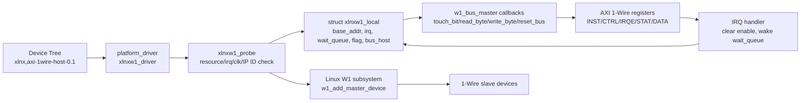
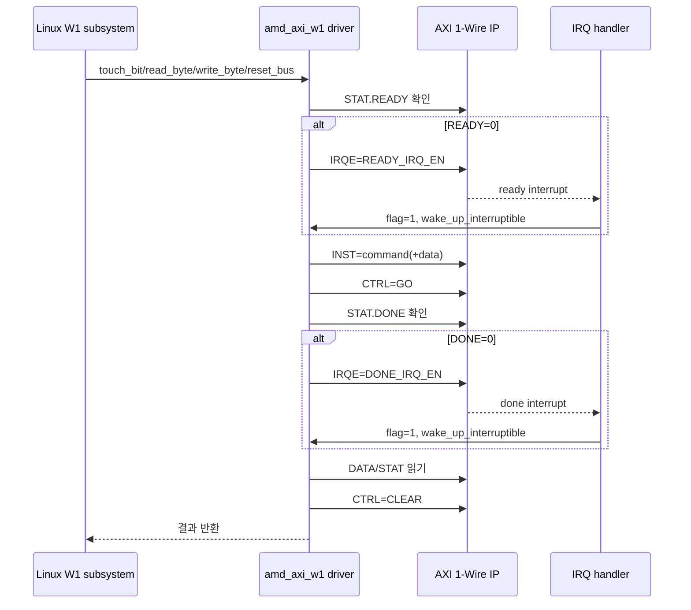

# `amd_axi_w1.c` 분석

## 개요

`amd_axi_w1.c`는 AXI 1-Wire Host IP를 Linux의 표준 1-Wire 서브시스템(`drivers/w1`)에 연결하는 플랫폼 드라이버입니다. 디바이스 트리 compatible 문자열 `xlnx,axi-1wire-host-0.1`로 매칭되고, `struct w1_bus_master` 콜백을 등록하여 Linux 1-Wire slave 드라이버들이 이 AXI IP를 일반 1-Wire bus master처럼 사용할 수 있게 합니다.

## 블록 다이어그램

## 주요 상수와 레지스터

| 항목 | 값 | 의미 |
|---|---:|---|
| `AXIW1_INST_REG` | `0x0` | 1-Wire 명령 및 송신 데이터 레지스터입니다. |
| `AXIW1_CTRL_REG` | `0x4` | `GO`, reset 제어 레지스터입니다. |
| `AXIW1_IRQE_REG` | `0x8` | `READY`, `DONE` 인터럽트 enable 레지스터입니다. |
| `AXIW1_STAT_REG` | `0xC` | `DONE`, `READY`, presence failure 상태를 읽는 레지스터입니다. |
| `AXIW1_DATA_REG` | `0x10` | 수신 bit/byte 데이터를 읽는 레지스터입니다. |
| `AXIW1_IPVER_REG` | `0x18` | IP 버전 확인용 레지스터입니다. |
| `AXIW1_IPID_REG` | `0x1C` | IP 식별값 확인용 레지스터입니다. 기대값은 `0x10ee4453`입니다. |

## 핵심 자료구조

`struct xlnxw1_local`은 드라이버 인스턴스 상태를 보관합니다.

| 필드 | 역할 |
|---|---|
| `dev` | Linux device 포인터입니다. |
| `base_addr` | MMIO로 매핑된 AXI 1-Wire 레지스터 base 주소입니다. |
| `irq` | IP 인터럽트 번호입니다. |
| `flag` | IRQ 발생 여부를 wait queue에 전달하는 atomic flag입니다. |
| `wait_queue` | `READY`/`DONE` 대기용 wait queue입니다. |
| `bus_host` | Linux 1-Wire 서브시스템에 등록되는 master 콜백 테이블입니다. |

## 콜백 및 함수 흐름

| 함수 | 역할 |
|---|---|
| `xlnxw1_wait_irq_interruptible_timeout` | 지정한 IRQ enable 비트를 쓰고, IRQ handler가 flag를 set할 때까지 timeout 포함 대기합니다. |
| `xlnxw1_touch_bit` | Linux W1 `touch_bit` 콜백입니다. read slot 또는 write-0 동작을 IP 명령으로 수행합니다. |
| `xlnxw1_read_byte` | `AXIW1_READBYTE` 명령을 실행하고 `DATA` 레지스터의 하위 8비트를 반환합니다. |
| `xlnxw1_write_byte` | `AXIW1_WRITEBYTE + val`을 instruction 레지스터에 기록해 1바이트를 송신합니다. |
| `xlnxw1_reset_bus` | AXI IP reset 후 `INITPRES` 명령으로 reset/presence detect를 수행합니다. |
| `xlnxw1_reset` | IP 레지스터를 reset/clear 상태로 초기화합니다. |
| `xlnxw1_irq` | IRQ enable 레지스터를 clear하고 wait queue를 깨웁니다. |
| `xlnxw1_probe` | MMIO, IRQ, clock을 획득하고 IP ID/version을 확인한 뒤 W1 master를 등록합니다. |
| `xlnxw1_remove` | 등록한 W1 master를 제거합니다. |

## 명령 실행 시퀀스

## Probe 단계

1. `devm_kzalloc`으로 `xlnxw1_local`을 생성합니다.
2. `devm_platform_ioremap_resource`로 AXI 레지스터를 MMIO 매핑합니다.
3. `platform_get_irq`와 `devm_request_irq`로 인터럽트를 연결합니다.
4. wait queue와 clock을 초기화합니다.
5. `AXIW1_IPID_REG`와 `AXIW1_IPVER_REG`를 읽어 지원 IP인지 확인합니다.
6. `struct w1_bus_master` 콜백을 채우고 `w1_add_master_device`로 등록합니다.

## 설계상 특징

- Linux W1 framework와 직접 통합되므로 userspace가 별도 ioctl 프로토콜을 몰라도 `w1` slave 드라이버/도구를 사용할 수 있습니다.
- busy polling 대신 READY/DONE 인터럽트를 enable하고 wait queue로 대기합니다.
- IP version major 값 검사를 통해 향후 호환되지 않는 하드웨어를 거부하도록 구성되어 있습니다.
