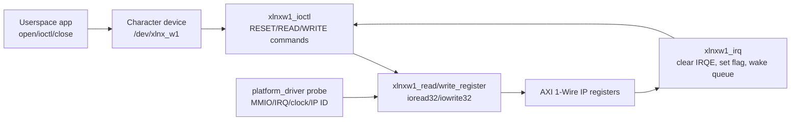
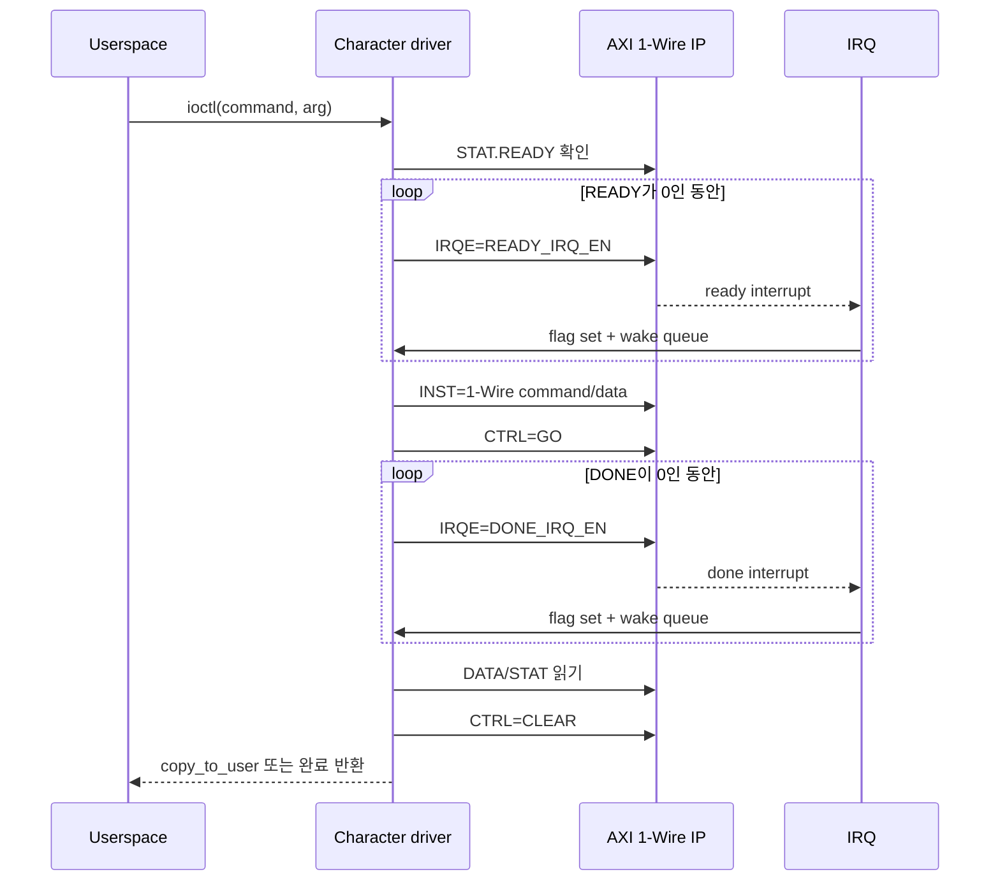
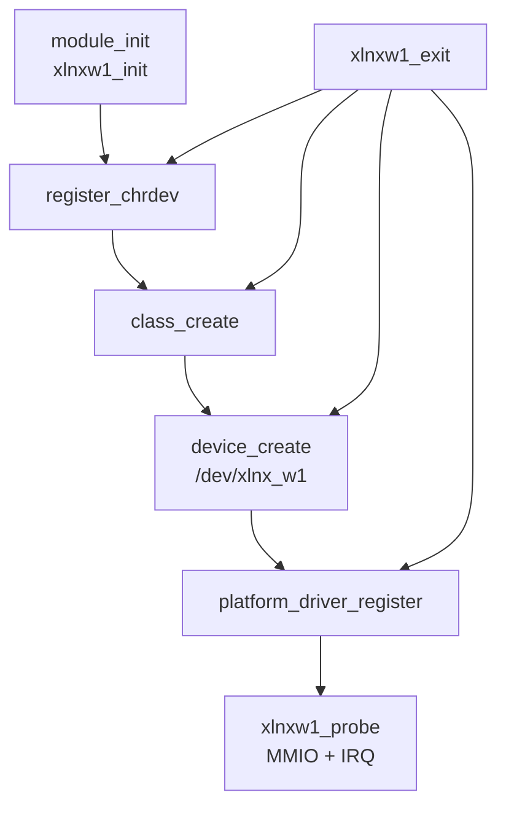

# `w1chardev.c` 분석

## 개요

`w1chardev.c`는 AXI 1-Wire Host IP를 단순 character device(`/dev/xlnx_w1`)로 노출하는 예제 Linux 커널 모듈입니다. userspace 애플리케이션은 `ioctl()`로 reset, bit read/write, byte read/write 명령을 요청하고, 드라이버는 AXI 레지스터를 직접 제어하여 1-Wire 트랜잭션을 수행합니다.

## 블록 다이어그램

## ioctl 인터페이스

| ioctl | 방향 | 동작 |
|---|---|---|
| `XLNX_IOCTL_RESET_BUS` | read | IP reset 후 reset/presence sequence를 실행하고 presence failure 값을 userspace로 복사합니다. |
| `XLNX_IOCTL_READ_BIT` | read | 1-Wire read-bit 명령을 실행하고 수신 bit를 반환합니다. |
| `XLNX_IOCTL_WRITE_BIT` | write | userspace에서 받은 1비트를 1-Wire bus에 씁니다. |
| `XLNX_IOCTL_READ_BYTE` | read | 1바이트 수신 명령을 실행하고 수신 byte를 반환합니다. |
| `XLNX_IOCTL_WRITE_BYTE` | write | userspace에서 받은 1바이트를 1-Wire bus에 씁니다. |

## 레지스터와 명령

| 정의 | 값 | 의미 |
|---|---:|---|
| `AXIW1_INST_REG` | `0x0` | 명령/송신 데이터 레지스터입니다. |
| `AXIW1_CTRL_REG` | `0x4` | `GO`, reset 제어 레지스터입니다. |
| `AXIW1_IRQE_REG` | `0x8` | READY/DONE 인터럽트 enable 레지스터입니다. |
| `AXIW1_STAT_REG` | `0xC` | READY/DONE/PRESENCE 상태 레지스터입니다. |
| `AXIW1_DATA_REG` | `0x10` | 수신 데이터 레지스터입니다. |
| `AXIW1_INITPRES` | `0x00000800` | reset/presence detect 명령입니다. |
| `AXIW1_READBIT` / `AXIW1_WRITEBIT` | `0xC00` / `0xE00` | bit read/write 명령입니다. |
| `AXIW1_READBYTE` / `AXIW1_WRITEBYTE` | `0xD00` / `0xF00` | byte read/write 명령입니다. |

## 주요 함수

| 함수 | 역할 |
|---|---|
| `xlnxw1_write_register` / `xlnxw1_read_register` | 전역 MMIO base(`xlnxw1_base_register`) 기준으로 IP 레지스터를 접근합니다. |
| `xlnxw1_ioctl` | ioctl command별로 READY 대기, instruction 기록, `GO` set, DONE 대기, 결과 복사/clear를 수행합니다. |
| `xlnxw1_open` / `xlnxw1_release` | 단일 open만 허용하고 module reference count를 관리합니다. |
| `xlnxw1_irq` | IRQ enable을 clear하고 atomic flag를 set한 뒤 wait queue를 깨웁니다. |
| `xlnxw1_probe` | 플랫폼 리소스, IRQ, clock, IP ID를 확인하고 MMIO base를 전역 변수에 저장합니다. |
| `xlnxw1_init` / `xlnxw1_exit` | character device major, class, device node, platform driver를 등록/해제합니다. |

## ioctl 공통 시퀀스

## 설계상 특징과 주의점

- 튜토리얼용 character driver로, Linux W1 subsystem에 통합되는 `amd_axi_w1.c`보다 userspace에 직접적인 ioctl API를 노출합니다.
- `xlnxw1_base_register`, wait queue, flag가 전역 변수라 단일 IP 인스턴스 예제에 적합합니다.
- `device_in_use`로 중복 open을 방지합니다.
- IRQ 기반 대기를 사용하지만 timeout 처리는 별도로 두지 않습니다.

## 재검토 보강: Character device ABI 관점

### userspace ABI와 커널 내부 동작 매핑

| Userspace 요청 | 커널 내부 명령 | 반환 데이터 |
|---|---|---|
| `RESET_BUS` | `AXI_RESET` 후 `AXIW1_INITPRES` 실행 | `0`: presence 감지, `1`: 미감지/실패 |
| `READ_BIT` | `AXIW1_READBIT` 실행 | `DATA[0]` |
| `WRITE_BIT` | `AXIW1_WRITEBIT + (val & 1)` 실행 | 없음 |
| `READ_BYTE` | `AXIW1_READBYTE` 실행 | `DATA[7:0]` |
| `WRITE_BYTE` | `AXIW1_WRITEBYTE + (val & 0xFF)` 실행 | 없음 |

### 리소스 생명주기

### 분석 결론

이 파일은 교육 목적의 직접 제어 ABI를 보여줍니다. 단일 device node와 전역 MMIO 포인터를 사용하므로 구조가 단순하지만, production driver 관점에서는 multi-instance, timeout, file-private state 보강이 필요합니다.
