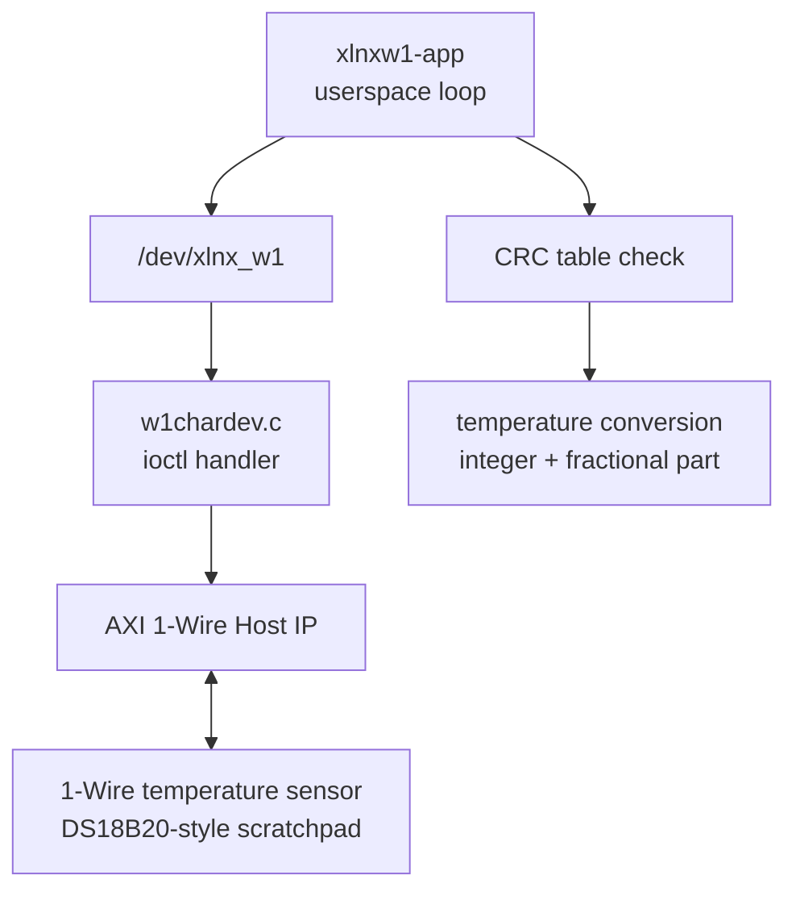
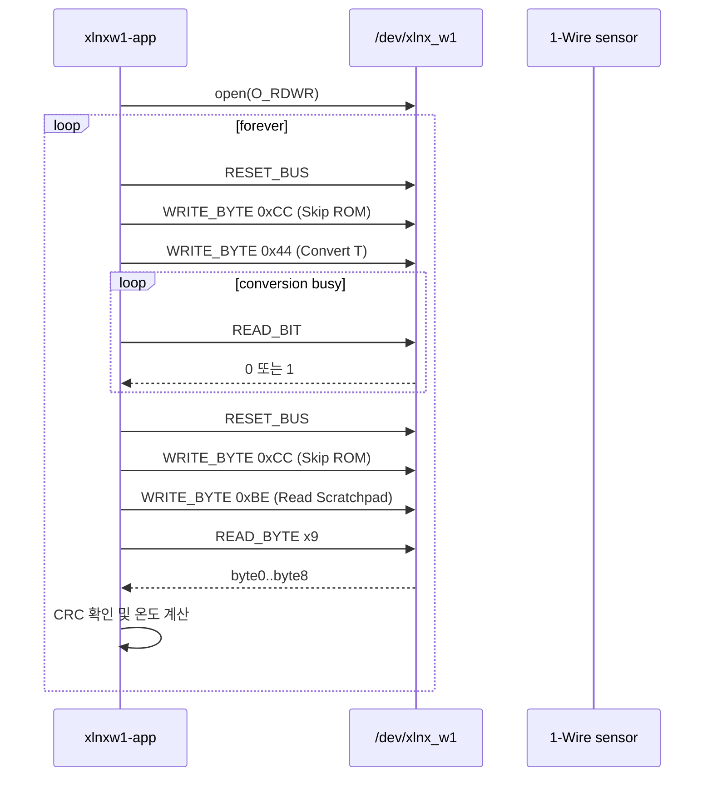
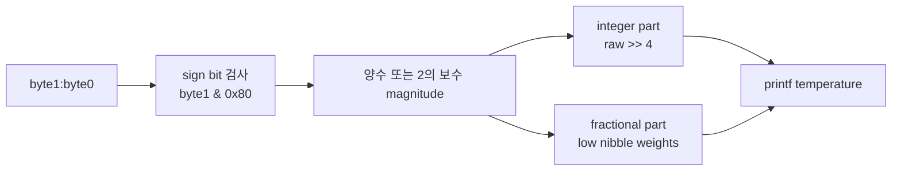

# `xlnxw1-app.c` 분석

## 개요

`xlnxw1-app.c`는 character driver(`/dev/xlnx_w1`)를 사용하는 userspace 테스트 애플리케이션입니다. ioctl로 AXI 1-Wire Host IP를 제어하여 DS18B20 계열 온도 센서의 scratchpad를 읽고, CRC를 검증한 뒤 온도를 출력합니다.

## 블록 다이어그램

## ioctl 사용

| 단계 | ioctl/값 | 의미 |
|---|---|---|
| 1 | `XLNX_IOCTL_RESET_BUS` | 1-Wire reset 및 presence 확인입니다. |
| 2 | `XLNX_IOCTL_WRITE_BYTE`, `0xCC` | Skip ROM 명령입니다. 단일 센서 연결을 가정합니다. |
| 3 | `XLNX_IOCTL_WRITE_BYTE`, `0x44` | Convert T 명령으로 온도 변환을 시작합니다. |
| 4 | `XLNX_IOCTL_READ_BIT` 반복 | 센서가 변환 완료를 알릴 때까지 polling합니다. |
| 5 | reset + `0xCC` + `0xBE` | scratchpad 읽기 시퀀스를 시작합니다. |
| 6 | `XLNX_IOCTL_READ_BYTE` 9회 | 온도, 설정, reserved, CRC byte를 읽습니다. |

## 주요 처리 흐름

## 데이터 해석

- `byte0`, `byte1`은 온도 raw 값의 LSB/MSB입니다.
- `byte8`은 앞 8바이트에 대한 CRC 값으로 사용됩니다.
- MSB의 sign bit가 set되어 있으면 2의 보수로 음수 온도를 계산합니다.
- fractional part는 하위 4비트에 대해 `0.5`, `0.25`, `0.125`, `0.0625` °C 단위를 정수 4자리 소수 형태로 변환합니다.

## 오류 처리

- device open 실패, ioctl 실패, presence failure 발생 시 `err` label로 이동해 fd를 닫고 종료합니다.
- CRC가 맞지 않으면 온도 대신 `CRC does not match`를 출력하고 다음 루프를 계속합니다.

## 재검토 보강: 온도 변환 세부

### Scratchpad byte 사용

| Byte | 의미 | 이 애플리케이션의 사용 |
|---:|---|---|
| `byte0` | Temperature LSB | raw temperature 하위 byte |
| `byte1` | Temperature MSB/sign | sign 판정 및 상위 byte |
| `byte2`~`byte4` | TH/TL/config | CRC 계산에 포함 |
| `byte5`~`byte7` | reserved | CRC 계산에 포함 |
| `byte8` | CRC | 앞 8바이트로 계산한 CRC와 비교 |

### 계산 흐름

### 분석 결론

애플리케이션은 ROM search를 수행하지 않고 `Skip ROM(0xCC)`을 사용하므로 버스에 단일 온도 센서가 연결된 실습 구성을 전제로 합니다. 다중 1-Wire device 버스에서는 ROM 선택 단계가 추가로 필요합니다.
